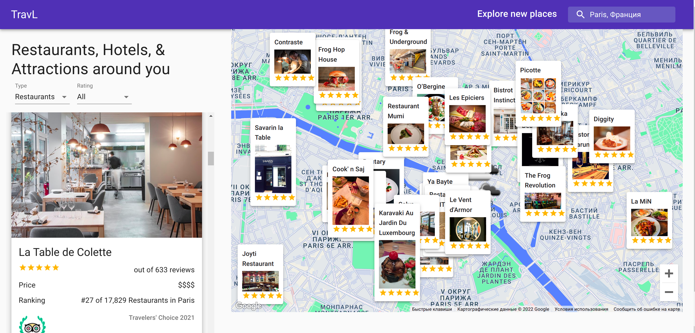

# TravL



## Introduction

A simple travel advisor web app, which uses Google Maps. You can search for restaurants, hotels and attractions around you, or any other place. It also shows the weather information on the map, so that you know when it is better to visit the place of your choice.

## Run Locally

Clone the project

```bash
  git clone https://github.com/okilbekov/TravL.git
```

Go to the project directory

```bash
  cd travl
```

Install dependencies

```bash
  npm install
```

Start the server

```bash
  npm start
```